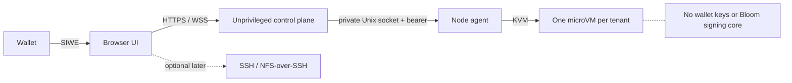

# Bloom Workspaces

Bloom Workspaces is a public-signup prototype for disposable, wallet-authenticated Linux machines. A user signs an [ERC-4361 SIWE](https://eips.ethereum.org/EIPS/eip-4361) message in the browser and receives a short-lived shell without installing a Bloom binary.

This repository implements a real end-to-end example:

- injected-wallet SIWE login with audience, expiry, network binding, and replay protection;
- public admission with Turnstile, rolling wallet/IP limits, global capacity, and a FIFO queue;
- one KVM microVM per workspace through QEMU or Firecracker;
- a browser terminal over HTTPS/WebSocket;
- Firecracker terminal transport over AF_VSOCK, without relying on a production serial-console contract;
- independent node-agent lease enforcement and VM destruction;
- reconnectable guest PTYs with bounded output history;
- strict startup guards that reject unsafe public configurations.

The original research prompt is [bloom-directory/pm#38](https://github.com/bloom-directory/pm/issues/38). The implementation deliberately makes browser/HTTPS the reliable default. Native NFS is an optional experiment, not the security or onboarding foundation.

## Public, without an allowlist

The product does not require an allowlist. Anyone can sign in and request compute, subject to automatic controls:

- one active workspace per wallet;
- configurable concurrent and rolling 24-hour limits per wallet and IP;
- a hard global running-VM ceiling and bounded FIFO queue;
- Cloudflare Turnstile in public mode;
- fixed VM CPU, memory, disk, and lease limits;
- no guest Internet access in the initial public profile.

Wallets are cheap identities, so wallet authentication alone is not an abuse defense. These controls bound cost even under Sybil traffic. Billing or stronger proof-of-personhood can be added later without changing the workspace boundary.

## Run the working example

Requirements: Linux, Node 22+, KVM access, `qemu-system-x86_64`, a C compiler, and `mkfs.ext4`.

```bash
npm install
ops/images/build-demo-image.sh
npm run dev:vm
```

Open <http://127.0.0.1:8787>, choose **Local demo sign-in**, and create a workspace. `npm run dev:firecracker` runs the same flow on Firecracker. The image script downloads only pinned artifacts and verifies their SHA-256 digests.

`npm run dev` uses a host process for quick UI development. It is not isolation, is prominently labeled as development-only, and the server refuses to use it when `BLOOM_PUBLIC_MODE=1`.

Run the automated and live checks with:

```bash
npm run check
npm run build
npm run smoke:live   # while a local workspace is running
```

## Architecture



The control plane has no KVM access. The node agent has no wallet or application signing secrets. In production, systemd places both in separate Unix users and keeps all VM children in the agent cgroup so an agent crash kills its machines.

Read [Architecture](docs/architecture.md), [Threat model](docs/threat-model.md), and [Public launch](docs/public-launch.md) before exposing a deployment.

## What this is—and is not

This is suitable for a capped public pilot, onboarding experience, and live isolation demonstration after the launch checklist is completed on a dedicated host.

It is not yet a production financial environment. Never put seed phrases, funded private keys, platform credentials, or Bloom’s signing/approval core inside a workspace. The operator is trusted for compute confidentiality. A future Bloom integration should start watch-only or on testnet and use an independently authenticated approval service outside the VM.

Native Internet-facing NFS is not enabled. The compatibility and security findings are in [NFS research](docs/nfs-research.md); macOS validation remains an empirical device/network test, not an architectural dependency.

## Repository map

- `web/` — wallet login, queue state, and xterm browser terminal.
- `src/control/` — sessions, SIWE, admission, lifecycle, and WebSocket proxy.
- `src/agent/` — private node API, hard expiry, QEMU, Firecracker, and vsock transport.
- `ops/images/` — reproducible Alpine demo image and static guest agent.
- `ops/systemd/` — separate unprivileged QEMU and root/jailer Firecracker service boundaries.
- `docs/` — architecture, threat model, NFS findings, testing, and launch gates.

MIT. Experimental software; no warranty.
