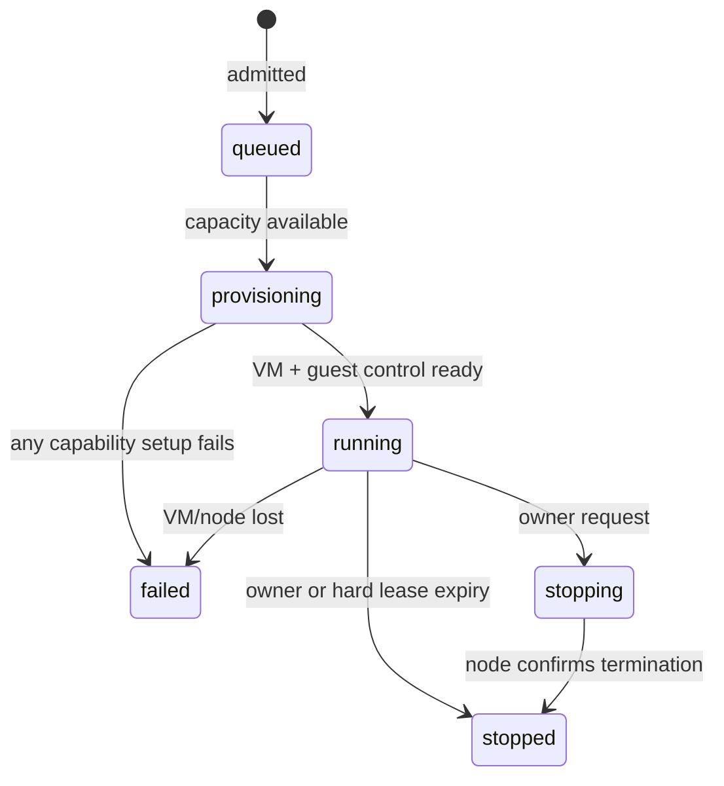

# Architecture

## Product shape

Bloom Workspaces exposes hostile, arbitrary user code through a small set of explicit capabilities. The zero-install surface is the browser; SSH and NFS reuse the same workspace identity and lease but are optional desktop transports.

```mermaid
flowchart LR
  Wallet[Injected wallet or WalletConnect] -->|SIWE only| Browser[Browser UI]
  Browser -->|HTTPS / terminal WSS| Control[Unprivileged control plane]
  CLI[OpenSSH ProxyCommand] -->|short-lived bearer + WSS| Control
  Control -->|private Unix socket + node token| Agent[Node agent]
  Agent -->|KVM + private guest control| VM[QEMU or Firecracker VM]
  Agent -->|policy proxy| Internet[Allowlisted package hosts]
  VM --> Data[Independent /workspace ext4 volume]
  VM --> Bloom[/bloom watch-only surface]
  CLI -. NFS-only SSH forward .-> Nfs[NFSD on guest loopback]
```

## Trust boundaries

The browser proves wallet control with a canonical SIWE message. The signature authenticates a session; it is never a transaction approval. The control plane owns sessions, CSRF/origin checks, Turnstile, quotas, queue state, metadata, and public relays. It has no KVM device or SSH CA private key.

The node agent owns VM processes, data volumes, controlled egress proxies, the SSH CA, and hard expiry. It listens on a permission-restricted Unix socket and independently authenticates every request with a random bearer. It sends a guest only the authenticated public wallet address and the SSH CA public key—never a signer, session cookie, Turnstile secret, or private key.

The guest controller runs as root only to mount the volume, start sshd/NFSD, and launch restricted workloads. Terminal shells and jobs run as UID/GID 1000 with no supplementary groups, no-new-privileges, an empty capability bounding set, bounded rlimits, structured argv, an environment allowlist, process-group cancellation, and bounded retained logs.

## Guest surfaces

- `/workspace` is disposable by default or an independently managed persistent ext4 disk. Guest file operations are rooted beneath it, reject traversal and symlink escapes, cap individual transfers at 8 MiB, and enforce the volume quota.
- `/bloom` publishes an identity/read-only service description. The verified static Bloom CLI stores only a watch wallet and exposes its VFS via `bloom vfs`; signing and transactions are always false in the capability response.
- Guest control is a versioned, bounded JSON-lines protocol over QEMU virtio-serial or Firecracker vsock. It supports files, jobs, Bloom status, and one-time private-connection setup.
- SSH uses an ephemeral guest host key and operator user CA. Shell certificates force the reviewed interactive helper and forbid forwarding. NFS certificates force `/bin/false`, forbid PTYs, and permit only local forwarding to `127.0.0.1:2049`.

## Lifecycle and recovery



The lease begins at admission, so queue time cannot create an unbounded future obligation. The agent revokes SSH streams before stopping the VM and sweeps VM and certificate expiry every second.

SQLite contains control metadata, opaque session hashes, hashed IPs, volume records, and bounded audit details. A persistent volume survives workspace IDs but remains associated with one normalized wallet until explicit destruction. On an agent restart, systemd `KillMode=control-group` kills child VMs and reconciliation marks prior workspaces failed rather than claiming recovery that did not happen.

## Network profiles

`none` gives QEMU restricted user networking and no proxy route. `controlled` starts one private policy proxy per workspace. It resolves every allowed hostname itself, rejects any non-public DNS answer, pins the selected address, validates HTTPS ClientHello/SNI before opening upstream TLS, and applies byte/connection/time budgets. Only HTTP and HTTPS to configured public package hosts are available. `internet` exists for local development but is rejected in public mode.

Firecracker uses vsock for terminal, guest control, and controlled proxy transport; no public TAP path is implied. QEMU is the complete persistence/SSH/NFS reference runtime. Jailed Firecracker intentionally reports durable data and native NFS unsupported until their host lifecycle can be proven without weakening the jail boundary.

## Scaling boundary

This is a capped single-node pilot. Multi-node production requires durable scheduling, node fencing/heartbeats, encrypted volume lifecycle, backup/deletion policy, failure-domain testing, metrics, abuse response, and spend controls. Those are deployment-system responsibilities, not claims made by this example.
