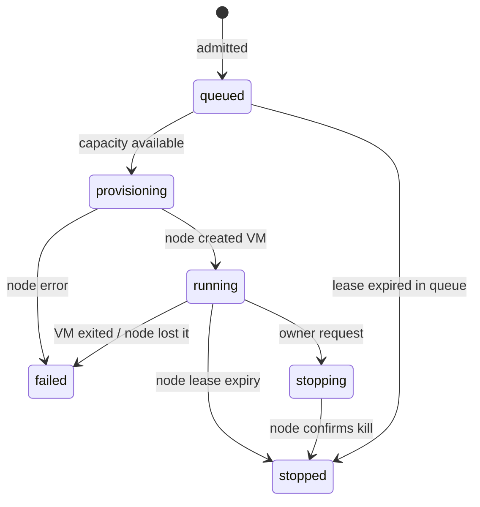

# Architecture

## Product shape

Bloom Workspaces is a transport-neutral remote workspace service. Browser terminal access is the zero-install path. SSH and mounted filesystems can be added as optional clients without changing identity, admission, or isolation.

The workspace contains two conceptual trees:

- `/workspace`: normal, disposable Linux files and tools;
- `/bloom`: a future scoped service interface, never the trusted signing core itself.

Arbitrary shell execution is intentional. The user receives root inside their own disposable VM. The shell is therefore treated as a hostile tenant workload at every other boundary.

## Components

### Browser

The browser creates a canonical SIWE message, asks the wallet to sign it, creates or stops a workspace, and attaches xterm to a same-origin WebSocket. The signature only authenticates login; it never approves a transaction.

### Control plane

The unprivileged Node service owns:

- SIWE challenges and opaque HTTP-only sessions;
- CSRF and Origin validation;
- wallet/IP quotas and the FIFO queue;
- desired workspace state and audit events;
- a bounded WebSocket relay.

It does not own `/dev/kvm`, VM images, the Firecracker CA, wallet keys, or financial signing material.

### Node agent

The node agent listens only on a permission-restricted Unix socket and also requires a random bearer token. It owns VM processes and independently sweeps lease deadlines once per second. API requests cannot create a lease beyond the node maximum.

The public configuration accepts only QEMU or jailed Firecracker. It cannot silently fall back to the development process runtime.

### Guest

The Alpine image starts a small static C agent as PID 1's supervised child. On Firecracker it accepts a terminal on AF_VSOCK port 5000, owns a guest PTY, retains a bounded reconnect buffer, and preserves the shell across browser reconnects. QEMU uses its serial device for the development/pilot terminal.

The guest reads a lease deadline from the kernel command line and powers off when reached. This is defense in depth only: a root tenant can alter guest processes, so the host node agent remains authoritative.

## Lifecycle

The lease begins at admission. Queue time therefore consumes the lease rather than creating an unbounded future obligation. A production UI may choose to offer a fresh lease when provisioning starts, but only with a separate reservation/cost policy.

## Data and recovery

SQLite stores only control metadata, opaque session hashes, hashed IPs, and bounded audit detail. Expired sessions are removed and stopped workspace/audit metadata is retained for 30 days by default. VM disk images live on the node and are deleted at stop. There are no automatic snapshots.

If the control plane restarts, it reconciles its running rows with the node. If the node agent restarts, systemd `KillMode=control-group` kills all child VMs; the control plane marks the old workspaces failed and users request fresh ones. This favors honest deletion and simple recovery over pretending a shell survived.

## Network profile

The first public profile is air-gapped. QEMU uses restricted user networking; Firecracker has no network interface. Browser terminal traffic is host-to-guest only. This makes the example safe enough to expose before an audited egress proxy exists.

Useful Internet egress is a later, explicit capability. It must block host/private/link-local/metadata ranges, SMTP and raw sockets; rate-limit DNS and HTTP(S); and have per-workspace byte/connection budgets. Firecracker itself does not filter guest traffic, so a TAP device must never be attached without host policy.

## Scaling path

The current SQLite/single-node system is deliberately bounded. Multi-node production work requires a durable queue, node heartbeats/fencing, per-node capacity offers, encrypted volume lifecycle, failure-domain-aware deletion, and recovery drills. None of that is necessary to learn from the capped public pilot.
